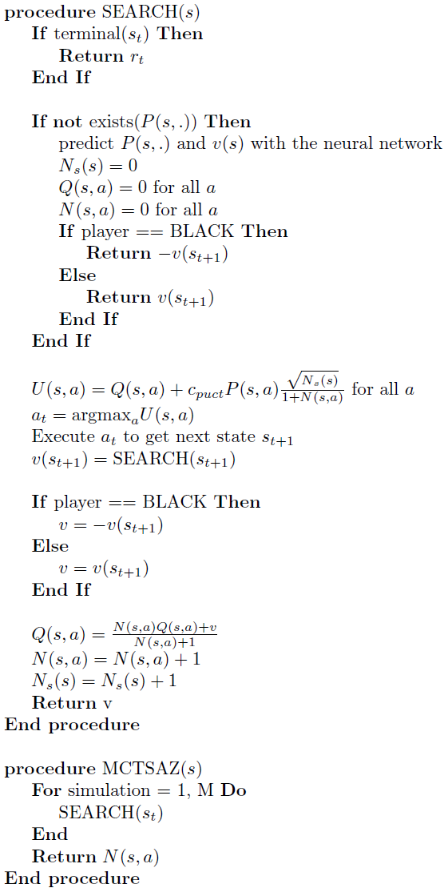
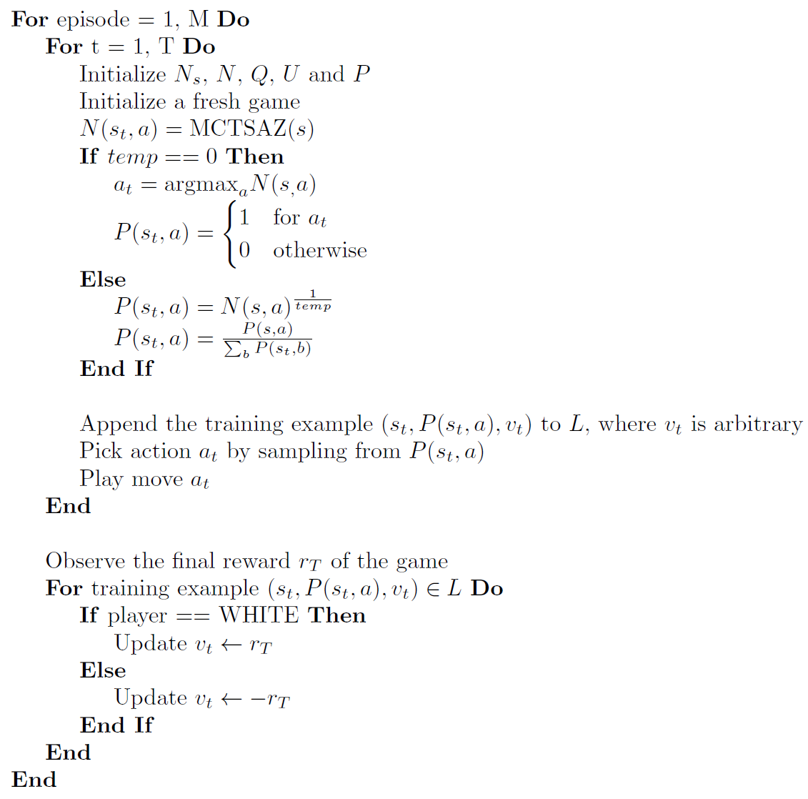

# Alpha Zero for Connect4

## Goal of this Project 
As a chess player Alpha Zero immediately fascinated me after I saw some games in 2017 that were played against Stockfish one of the strongest engines at the time. Alpha Zero played like like humans would love to play, like Garry Kasparov on steroids. As it is simply not possible to train Alpha Zero for chess with my limited computational resources I chose Connect4 as a model game. It is theoretically solved and has around 4.5 billion of legal games states. This makes it enough complex to be still interesting and the trained networks can directly be benchmarked against an optimal player.  

### Alpha Zero
Alpha Zero a reinforcement learning algorithm for board games developed by Google DeepMind. The ideas presented below are taken from the original [paper](https://arxiv.org/abs/1712.01815). The following resources gave me a better understanding of the algorithm and a worth reading:  
- [Simple Alpha Zero](https://web.stanford.edu/~surag/posts/alphazero.html)  
- [Lessons from Implementing Alpha Zero](https://medium.com/oracledevs/lessons-from-implementing-alphazero-7e36e9054191)  
- [From-scratch implementation of AlphaZero for Connect4](https://towardsdatascience.com/from-scratch-implementation-of-alphazero-for-connect4-f73d4554002a)  

The beauty about Alpha Zero is that absolutely no human knowledge is needed in order to train the neural network apart from the rules of the game. To master complex games like chess or Go a huge amount of computational power is needed and currently not doable on a single computer. [Leela Chess Zero](https://lczero.org/) is a pretty successful attempt to train Alpha Zero for chess with the help of distributed computing. Below is a high level overview of how the algorithm works before going into the details:  
- Self-Play: Get some training examples by letting the training network play against itself (self-play) by using a modified Monte-Carlo Tree Search (MCTS)
- Use the generated training examples from the self-play to train the network  
- Optional: Let the training network play against the current best network. If it reaches at least a certain score, the training network will become the best network. If not, the steps above are repeated. This step was removed in the latest version of the AlphaZero paper and not done in this project either. Always the last version of the network is used. 

#### *The neural network*
DeepMind used a deep convolutional residual neural network with 19 blocks and 256 3x3 filters. Since Connect4 is a much simple game and than chess and the training process should not take too long only 10 blocks with 128 3x3 convolutional filters are used in this project.  

###### Input Representation
The input of the network is always the current game state from the perspective of the red player. This differs form the original Alpha Zero paper as they used some passed games states as well. For each player a separate 6x7 matrix where 1 corresponds to the position of a disk and 0 if no disk is at this position. This is the equivalent of a very small image with 2 channels. The state representation cause some confusion that's why I decided to cover it briefly. Consider a small example to clarify the state representation: If it is red's move the red disks are represented in channel 1 and the yellow disk in channel 2. If it is yellow's move the red disks are represented in channel 2 and the yellow disks are represented in channel 1. This way the neural network gets the state of the games always presented from the perspective of the red player.

###### Output Representation 
After the residual blocks the network splits into two heads, a policy and a value head. The policy output of the network consists of a vector describing the probability over all possible actions. For Connect4 the policy can be described by a 7 dimensional vector because there are 7 possible columns in which a disk can be played. The value output of the network is a continuous value between -1 and 1 representing the outcome of the game for the current player where -1 means loss, 0 means draw and 1 means win. The value is also from the perspective of the red player. If it is yellow's a value output of 1 means that the yellow player will win with a probability of 100%. If on the other hand it is red's move a value output of 1 means that red will win win.  
 

#### *Monte-Carlo Tree Search*
Monte-Carlo Tree Search is a heuristic search algorithm. The idea is to treat the game like a tree. The current state of the game is the root node. By taking legal moves nodes of the tree can be reached that each represent a legal game state. Theoretically the whole tree of the game could be expanded to find the optimal move for the current state (Minimax algorithm). This is possible for very small games such as Tic Tac Toe and yes Connect4 as well but for larger games this is simply not doable. In pure Monte-Carlo search you would just play a number of rollouts (make simulations until you reach the end of the game). The moves are picked randomly. After the rollout were performed you choose the move with the highest win probability. After you reached the new position you repeat the process. If you make an infinite number of simulations this strategy will lead to best play. In games with an exponential growing tree such as chess it will not lead to good results as far too many simulations are needed.  

On improvement is to use an upper confidence bound during the tree search given by,  
  

During the tree search you always pick the action with the highest upper confidence bound. This ensures a balance between exploration and exploitation. The upper confidence bound is high for nodes that have not been visited often or nodes that have a high expected reward. At the end of the simulation the action with the highest probability to win is picked (i. .e. the action with the largest Q(s,a)) and a new simulation is started. By increasing the constant c_puct, the exploration term becomes more important and actions that were not visited a lot have a high upper confidence bound and are therefore more likely to be chosen. If c_puct is small exploitation dominates (i. e. high expected values Q(s,a) are the most important). MCTS works in a way that good moves are visited more often and give a good indication of what moves should be played (see Training Algorithm). A more detailed explanation and some code examples can be found [here](https://jeffbradberry.com/posts/2015/09/intro-to-monte-carlo-tree-search/).  
  
AlphaZero improved the MCTS further by using a different version of the upper confidence bound called the polynomial upper confidence trees (PUCT):

The MCTS that is used by Alpha Zero uses the network to predict the probabilities of an action to play. The algorithm to search one state is given by,

For every game state s we execute the procedure MCTSAZ(s) which returns N(s,a). This is the number of times an action a was chosen in state s. Below is the pseudo code of how this procedure is used during training.

#### *Training Algorithm*
We now have all the pieces to understand the actual Alpha Zero training algorithm:  
- Randomly initialize the weights of the neural network  
- Keep a copy of the network. Lets call it reference network. The reference network is the current best network of the training process.  
- *Self-Play*: In order to train the neural network we need training examples that are generated by self-play:

   

Executing the algorithm above we will get one training example after every move. The temperature can be kept > 0 for the whole game or it can be set to 0 after a few moves were played.   
- *Training*: After a few self-play games were played the training examples are used to train the training network. One example consists of (s, P, v), the state of the game s, the policy P and the value v. 
- *Evaluation*: This step was not in this project but is included for completeness. Let the training network play against the reference network. The games will be played exactly like the self-play games with the difference that the temperature will always be set to 0. This means that the network will play deterministically. If the training network reaches a certain score (e. g. 0.55) a copy of the training network is kept, which will be the new reference network for the next evaluation. If the training network can not beat the reference network it will be trained further.

The three steps described above are just repeated and eventually a very strong agent will be created. 
 

### Hyperparameters

### Results

### How to run

The idea of this project is to try out different reinforcement learning algorithms to learn the game Tic Tac Toe. Tic Tac Toe is easy to implement and has a small state space. This is why the training of the neural networks will be fast. The goal is to use successful algorithms for more complex games such as Othello or Chess.
The different algorithms are in the folder called rl. Each subfolder contains a different reinforcement learning algorithm. In order to run the algorithms  
- run MainSelfPlayTraining.py to learn an agent how to play the game  
- run MainTestPlay.py to let the agent play against a random opponent

