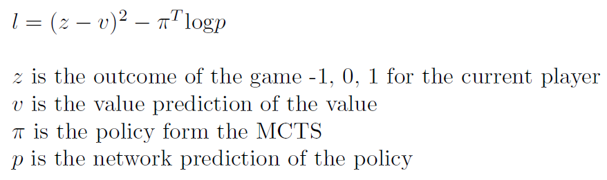
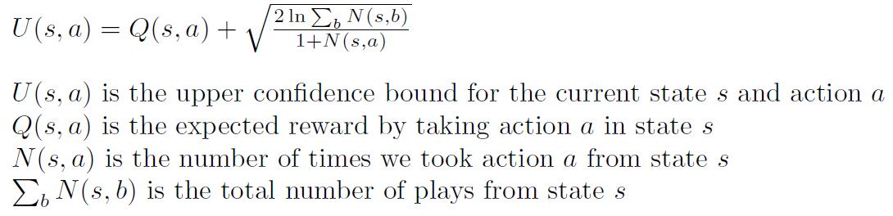
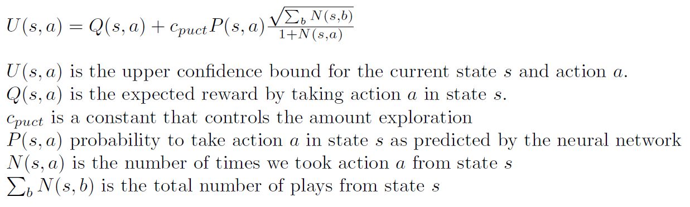
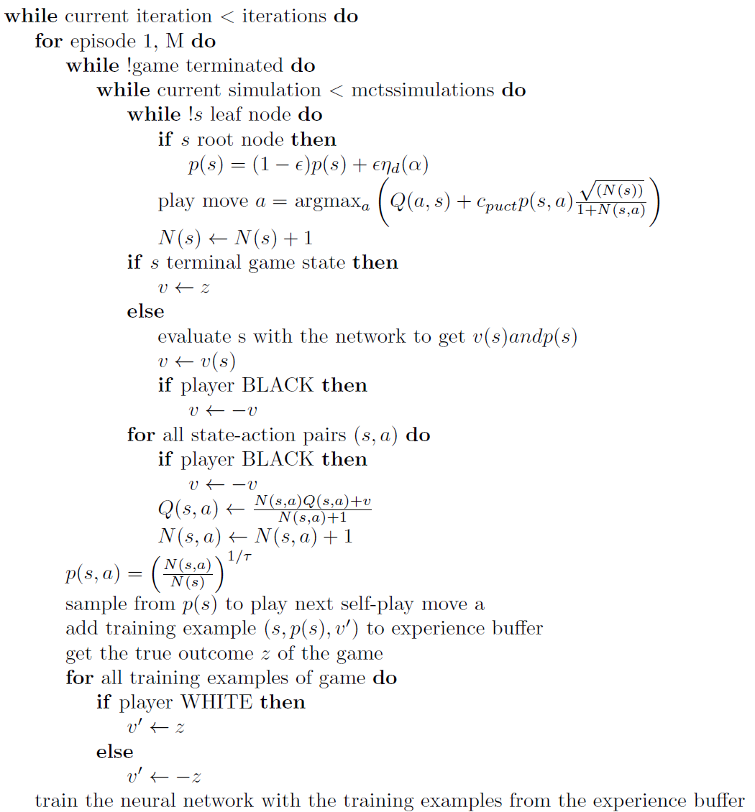
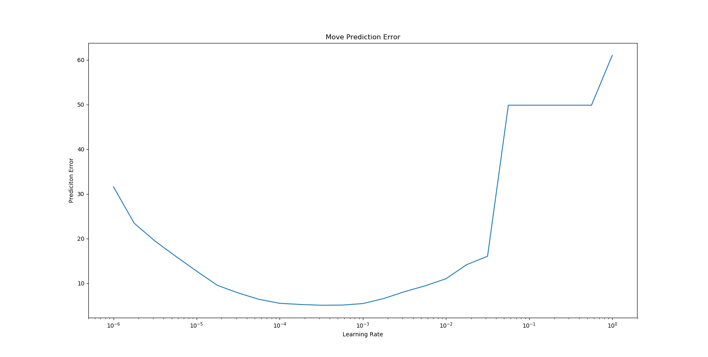
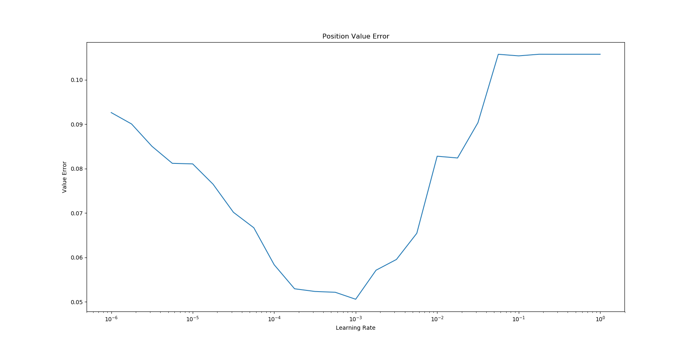

# Alpha Zero for Connect4

## Goal of this Project 
As a chess player Alpha Zero immediately fascinated me after I saw some games in 2017 that were played against Stockfish one of the strongest engines at the time. Alpha Zero played like like humans would love to play, like Garry Kasparov on steroids. As it is simply not possible to train Alpha Zero for chess with my limited computational resources I chose Connect4 as a model game. It is theoretically solved and has around 4.5 billion of legal games states. This makes it enough complex to be still interesting and the trained networks can directly be benchmarked against an optimal player.  

### Alpha Zero
Alpha Zero a reinforcement learning algorithm for board games developed by Google DeepMind. The ideas presented below are taken from the original [paper](https://arxiv.org/abs/1712.01815). The following resources gave me a better understanding of the algorithm and a worth reading:  
- [Simple Alpha Zero](https://web.stanford.edu/~surag/posts/alphazero.html)  
- [Lessons from Implementing Alpha Zero](https://medium.com/oracledevs/lessons-from-implementing-alphazero-7e36e9054191)  
- [From-scratch implementation of AlphaZero for Connect4](https://towardsdatascience.com/from-scratch-implementation-of-alphazero-for-connect4-f73d4554002a)  

The beauty about Alpha Zero is that absolutely no human knowledge is needed in order to train the neural network apart from the rules of the game. To master complex games like chess or Go a huge amount of computational power is needed and currently not doable on a single computer. [Leela Chess Zero](https://lczero.org/) is a pretty successful attempt to train Alpha Zero for chess with the help of distributed computing. Below is a high level overview of how the algorithm works before going into the details:  
- Self-Play: Get some training examples by letting the training network play against itself (self-play) by using a modified Monte-Carlo Tree Search (MCTS)
- Use the generated training examples from the self-play to train the network  
- Optional: Let the training network play against the current best network. If it reaches at least a certain score, the training network will become the best network. If not, the steps above are repeated. This step was removed in the latest version of the AlphaZero paper and not done in this project either. Always the last version of the network is used. 

#### *The neural network*
DeepMind used a deep convolutional residual neural network with 19 blocks and 256 3x3 filters. Since Connect4 is a much simple game and than chess and the training process should not take too long only 10 blocks with 128 3x3 convolutional filters are used in this project.  

###### Input Representation
The input of the network is always the current game state from the perspective of the red player. This differs form the original Alpha Zero paper as they used some passed games states as well. For each player a separate 6x7 matrix where 1 corresponds to the position of a disk and 0 if no disk is at this position. This is the equivalent of a very small image with 2 channels. The state representation cause some confusion that's why I decided to cover it briefly. Consider a small example to clarify the state representation: If it is red's move the red disks are represented in channel 1 and the yellow disk in channel 2. If it is yellow's move the red disks are represented in channel 2 and the yellow disks are represented in channel 1. This way the neural network gets the state of the games always presented from the perspective of the red player.

###### Output Representation 
After the residual blocks the network splits into two heads, a policy and a value head. The policy output of the network consists of a vector describing the probability over all possible actions. For Connect4 the policy can be described by a 7 dimensional vector because there are 7 possible columns in which a disk can be played. The value output of the network is a continuous value between -1 and 1 representing the outcome of the game for the current player where -1 means loss, 0 means draw and 1 means win. The value is also from the perspective of the red player. If it is yellow's a value output of 1 means that the yellow player will win with a probability of 100%. If on the other hand it is red's move a value output of 1 means that red will win win.  

###### Training Loss 
The loss is a combination of the value and the policy loss. For the value head the mean squared error is used and for the policy the cross entropy loss is used. The training loss is given by, 

 

#### *Monte-Carlo Tree Search*
Monte-Carlo Tree Search is a heuristic search algorithm. The idea is to treat the game like a tree. The current state of the game is the root node. By taking legal moves nodes of the tree can be reached that each represent a legal game state. Theoretically the whole tree of the game could be expanded to find the optimal move for the current state (Minimax algorithm). This is possible for very small games such as Tic Tac Toe and yes Connect4 as well but for larger games this is simply not doable. In pure Monte-Carlo search you would just play a number of rollouts (make simulations until you reach the end of the game). The moves are picked randomly. After the rollout were performed you choose the move with the highest win probability. After you reached the new position you repeat the process. If you make an infinite number of simulations this strategy will lead to best play. In games with an exponential growing tree such as chess it will not lead to good results as far too many simulations are needed.  

One improvement is to use an upper confidence bound during the tree search given by,  
  

During the tree search you always pick the action with the highest upper confidence bound. This ensures a balance between exploration and exploitation. The upper confidence bound is high for nodes that have not been visited often or nodes that have a high expected reward. At the end of the simulation the action with the highest probability to win is picked (i. .e. the action with the largest Q(s,a)) and a new simulation is started. By increasing the constant c_puct, the exploration term becomes more important and actions that were not visited a lot have a high upper confidence bound and are therefore more likely to be chosen. If c_puct is small exploitation dominates (i. e. high expected values Q(s,a) are the most important). MCTS works in a way that good moves are visited more often and give a good indication of what moves should be played (see Training Algorithm). A more detailed explanation and some code examples can be found [here](https://jeffbradberry.com/posts/2015/09/intro-to-monte-carlo-tree-search/).  

Before presenting some pseudocode is is useful to gain some intuition how the tree search in the Alpha Zero algorithm works:  
- The search starts form the current games state. This is called the root node.  
- The simulation runs until a leaf node is reached. This is a terminal games state where the outcome of the game is clear or a games state that has not yet been fed through the neural network. 

  
AlphaZero improved the MCTS further by using a different version of the upper confidence bound called the polynomial upper confidence trees (PUCT):

The MCTS that is used by Alpha Zero uses the network to predict the probabilities of an action to play.

### AlphaZero Algorithm

Lets first verbalize the algorithm to get a better intuition how the tree search used in AlphaZero works: In the first simulation we start at the root node. As this is not a terminal node and we have not yet evaluated it with the network this is a leaf node. The state is fed through the network to get the value and the policy. The are used to update all Q-values and visit counts. The first simulation is now finished. In the second simulation we start again at the root node. This time we have the value and the policy of the network. The move with the highest upper confidence bound is chosen to be played. After that we reach a leaf node where we fed the state again through the network (or take the real value if this is a terminal games state), update the Q-values and the visit counts. The second simulation is now finished. 
This process is now repeated until the desired number of simulations are reached. After all simulations are finished the policy is calculated from the visit counts of the legal child states. This policy is sampled to determine the next move to play. After the moves is played the tree search is started again. Each time a move is played we get a training example with the state of the game, the policy from the visit counts and the expected outcome of the position (value). These examples are later used to train the neural network. 
After training the network will be able to better predict the policy and the value of the game states. This way the network slowly improves and better moves are chosen during self-play.

The complete AlphaZero algorithm used in this project is described below.

### Hyperparameters
The Alpha Zero algorithm has many hyperparameters that need to be tuned right in order for the network no learn properly. If the parameters are off learning might be very slow or the performance improvement stops early. Below is a small overview of the tunable hyperparameters.

###### c_puct
This parameter controls the exploration in the tree search. The higher it is the more positions are explored during tree search. On the other hand the degree of exploitation is lower and more moves are played that do not maximize the reward. The trade-off between exploration and exploitation is a basic reinforcement learning problem. If exploitation is high moves that had a high reward in the past will be played again which is generally desirable as the agent should maximize the total reward. The agent needs to explore as well in order to find novel moves with an even greater reward. If exploration is too high the agent will not play moves that maximize the reward and if it is too low no new moves are found that might lead to a bigger reward. It is therefore essential that the balance between exploration and exploitation is just right for successful learning. Reasonable values for c_puct are between 1 and 6. In this project c_puct = 4 seems to work pretty well. 

###### Dirichlet parameter alpha
During the self-play phase in the MCTS the agent chooses moves according to the policy calculated by the network. Dirichlet noise is added to the probability of the root node in order to increase exploration. The dirichlet noise is only added for training and not for the evaluation. The larger alpha the more the agent explores. In the Alpha Zero paper it looks like the parameter was chosen by 10 / n, where n is the number of possible moves. In Connect4 there are 7 possible moves to play and alpha = 1 seemed to work the best. 

###### Temperature tau
The policy of the tree search is calculated form the visit count of the next possible state after a legal move is played. In MCTS good states are visited more often and it is therefore an indication that a moves should be played that leads to a state with a high visit count. The counts are exponentiated as follows: N^(1/tau), where tau is the temperature parameter. DeepMind chose tau = 1 for the first 30 moves in chess which will not modify the visit counts. After 30 moves the parameter was set to small value which has the effect of suppressing all values except the maximal visit count. In this project tau was just set to 1 for the whole training. The maximal visit count was therefore not boosted which leads to a slightly higher exploration in later games states. 

###### MCTS Simulation Count
DeepMind uses 1600 MCTS simulations during self-play in every game state before the next move is made. As Connect4 is a much simpler game only 200 simulations are used which lead to pretty good results. Of course the more simulations are made the more accurate the policy and the value and learning will be faster. The downside of increasing the number of simulations is that the self-play takes a lot longer which is the slowest part of the algorithm.

###### Self-Play Game Count
This defines how many games are played before the network is updated. Here a relatively small number of 200 games were chosen. The learning will be a bit noisier but the network will be improved right away. If you would for example play 1000 games the same network is used for the 1000 games. By using only 200 games the network would have been improved 4 times already after 1000 games were played. This seemed to increase the learning rate but it might also lead to an overfitting of the network as it is trained with the same examples much more often than if more games are used. 

###### Learning rate and batch size
As always in deep learning picking the right learning rate and batch size for training is critical. DeepMind used stochastic gradient decent to train the deep network. They started with a relatively high learning rate and decreased it several times during training. Here the Adam optimizer was used instead of stochastic gradient decent. Following the strategy described in this [paper](https://arxiv.org/abs/1506.01186) the learning rate for cyclical learning and normal learning was found by the learning rate test. The idea is to train the network for several epochs (here 8) and check the accuracy after training. This is done for a fixed batch size and multiple learning rates. The network does not learn fast enough if the learning rate is too low. If the learning rate is too large learning will not be stable and the network is not able to learn something. Below are the results for the value and the policy head for different learning rates and a batch size of 256. 

 

The plots above would suggest a minimal learning rate of 10-5 and a maximal learning rate of 10-4. For training a fixed learning rate of 10-4 was chosen although 10-3 also worked pretty well. For cyclical learning the minimal learning rate was set to 10-5 and the maximal learning rate to 10-4. A triangular learning rate schedule was chosen that restarts in every epoch.

###### Weight decay
To prevent overfitting of the network weight decay was used. The weight decay parameter was set to 10-4.

### Improvements
In this [article](https://medium.com/oracledevs/lessons-from-alpha-zero-part-6-hyperparameter-tuning-b1cfcbe4ca9a) some improvement are described that worked very well for Connect4. For completeness the strategies that were used in this project are described shortly below. They were not part of the original AlphaZero paper.

###### Position Averaging
Each self-play game will start form the beginning. Therefore there are many position duplicates in the training set. If 200 games are played there are 200 training examples with the same state but different policies and different values (1, 0 or -1). It might not be a good idea to present the same training example with different labels. In practice the network will learn to average the position but it is pretty easy to do and improves learning. Before training all duplicate positions were averaged. This way there are only unique positions in the training set. There are usually around 30%-40% or more of duplicate positions in the training set.

###### Extra Convolutional Filters in the Policy and Value Head
DeepMind only used 2 convolutional filters for the policy head and 1 filter for the value head. The filters were both increased to 32 which improved the training. This was also reported by Leela Chess.

###### Increasing Training Set Size
The games that are played at the beginning are not  perfect and will slow down the training later on when the network has improved. It is therefore beneficial to get rid of old data. DeepMind just used a fixed sized experience buffer. Here the minimal window size was set to 4 generations. If this size was reached the window size was increased by 1 every 2 generations. This has the effect that old data is kicked out of the training set pretty early in training. Every second generation the oldest generation data is removed from the training set. If the maximal window size was reached the window size was not increased anymore and the oldest generation data is removed in every training cycle. This is equivalent to DeepMinds fixed size experience buffer.  
At the beginning there is not much data and the neural network might be overfitted, this is why I experimented with making the initial window size larger and fill it with 0 generation data right at the beginning. This seems not to improve learning. I suspect the data set is increasing fast enough in order to avoid overfitting. 

### Results

### How to run

In order to run the algorithms  
- run MainSelfPlayTraining.py to learn an agent how to play the game  
- run MainPredicitonError.py to run the evaluation of with the test set that contains solved positions.
- run MainGui.py to play against a pretrained network. 

